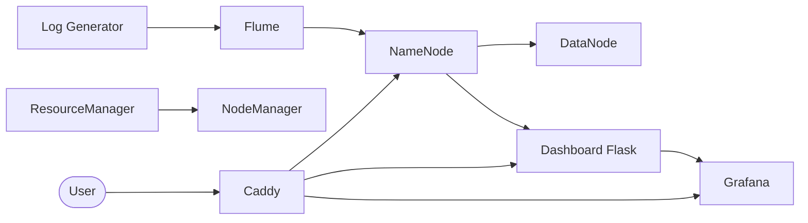
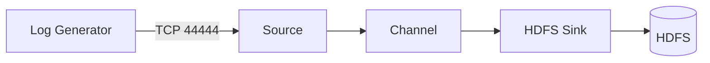

# Cluster Hadoop Big Data
### Pipeline temps réel optimisé

**Groupe 6 — Lomé Business School · 2026**

LAWSON-DJITO Steven · POTCHONA Justin · AMEDON Roland

---

# C'est quoi le Big Data ?

Des données **trop volumineuses ou complexes** pour les outils classiques.

### Les 5V

- **Volume** — téraoctets à pétaoctets
- **Vélocité** — flux continu, temps réel
- **Variété** — texte, images, logs, capteurs
- **Véracité** — fiabilité des données
- **Valeur** — insights exploitables

---

# C'est quoi HDFS ?

**Hadoop Distributed File System**

Stockage distribué par **blocs répliqués** sur plusieurs machines.

- **NameNode** → gère les métadonnées
- **DataNode** → stocke les blocs
- Tolérant aux pannes grâce à la réplication

→ *Le disque dur du cluster*

---

# C'est quoi YARN ?

**Yet Another Resource Negotiator**

Chef d'orchestre qui **distribue les ressources** (CPU, RAM) du cluster.

- **ResourceManager** → alloue les ressources
- **NodeManager** → exécute les tâches

→ *Le système d'exploitation du cluster*

---

# C'est quoi Flume ?

Outil d'**ingestion de logs** vers HDFS en temps réel.

### Modèle simple

**Source → Channel → Sink**

- Capte les données (Source)
- Les met en tampon (Channel)
- Les écrit dans HDFS (Sink)

→ *Le tapis roulant des logs*

---

# Architecture Docker du projet

**9 conteneurs orchestrés par Docker Compose**

---

# Rôle de chaque outil

| Outil             | Rôle dans le projet          |
|-------------------|------------------------------|
| **HDFS**          | Stocke les logs collectés    |
| **YARN**          | Gère les ressources          |
| **Flume**         | Ingère les logs vers HDFS    |
| **Log Generator** | Simule des logs e-learning   |
| **Dashboard**     | Visualisation temps réel     |
| **Grafana**       | Monitoring avancé            |
| **Caddy**         | Reverse proxy · URLs propres |

---

# Pipeline d'ingestion

Logs e-learning simulés → Flume → HDFS

---

# Cas pratique — Supervision e-learning LBS

**Scénario :** la plateforme pédagogique génère des logs en continu (connexions, TP, notes, erreurs).

### Ce que le cluster permet de faire

- Détecter les **incidents** (timeouts HDFS, quotas dépassés)
- Identifier les étudiants en **difficulté** (connexions échouées)
- Classer les **cours les plus consultés**
- Suivre la répartition **INFO / WARN / ERROR** en temps réel

### Test à la démo

`[ERROR] Upload échoué : e.potchona_tp_hadoop.zip — quota dépassé`
→ visible sur Dashboard & Grafana **en moins de 2 s**

---

# Conclusion

### Bilan
Cluster Hadoop **complet et fonctionnel** sous 3 GB de RAM.

### Perspectives
**Spark · Kafka · Hive · Kerberos**

---

## Merci

**Questions ?**
